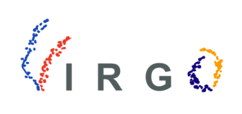

# Virgo

_Virgo_ (**V**ariational **I**nference package for unsupe**R**vised classification of (inter-)**G**alactic sh**O**ck waves)
is a Python package for classification of an unknown number of cosmological shock waves in a scalable, probabilistic and physically-motivated way.
It employs kernel principal component analysis with low-rank matrix approximations to denoise data sets of shocked particles and create labeled subsets.
It performs supervised classification to recover full data resolution with stochastic variational deep kernel learning.
The Virgo pipeline runs automatically, has only a few hyperparameters, and performs well on all tested data sets.

This repository is meant to accompany the publication "Virgo: Scalable Unsupervised Classification of Cosmological Shock Waves" and can be found [here](https://arxiv.org/abs/2208.06859)


## Project status

This project might still be suject to change. Feel free to contact [me](mailto:max.lamparth@tum.de?subject=virgo) for feedback and issues.

## Usage

### Installation

Get the package from [GitHub](https://github.com/maxlampe/virgo) and install it locally, as there is no pip release.

Python version 3.8 or above required.

```bash
git clone https://github.com/maxlampe/virgo
pip3 install -r requirements.txt
python3 -m pip install -e path-to-virgo-dir
```

### Getting started

Please see the demo notebooks in the respective directory to apply and use Virgo.

### Data files

Feel free to contact [us](mailto:max.lamparth@tum.de?subject=virgodata) and we will provide you with data sets form the paper.

## Development

### Design decisions

1. Style guide: [pep8](https://www.python.org/dev/peps/pep-0008/)
2. Docstring convention: [numpy](https://numpydoc.readthedocs.io/en/latest/format.html)
3. Ideally, you should use [black](https://pypi.org/project/black/) as code formatter.

**Maximum line length is 88** (default black enforced line length).

### Unit tests

None are currently implemented.

## License

[MIT](https://choosealicense.com/licenses/mit/)
